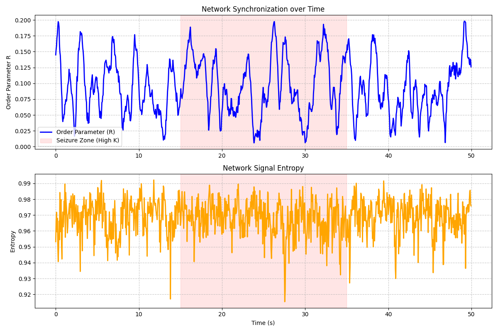
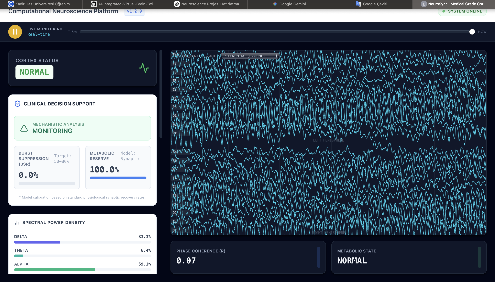
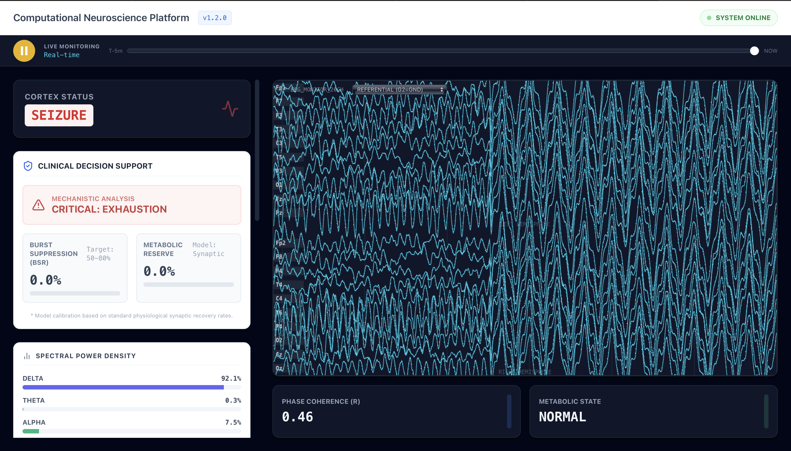
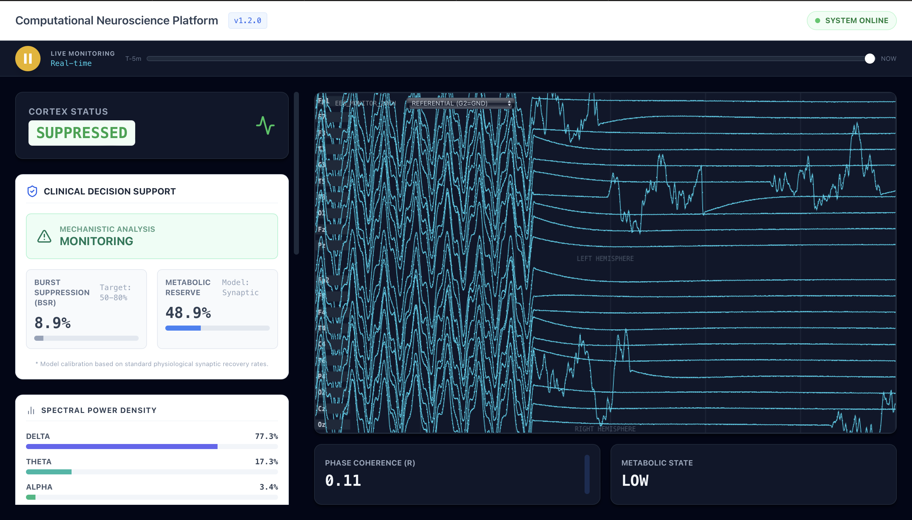
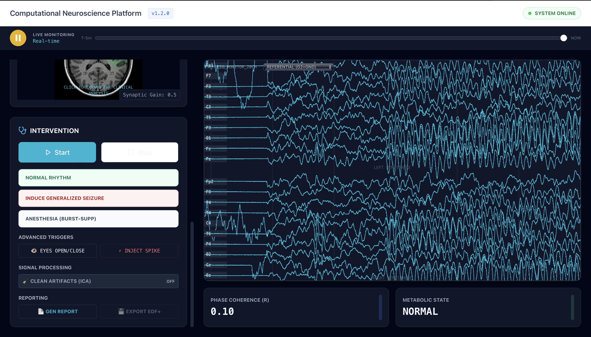
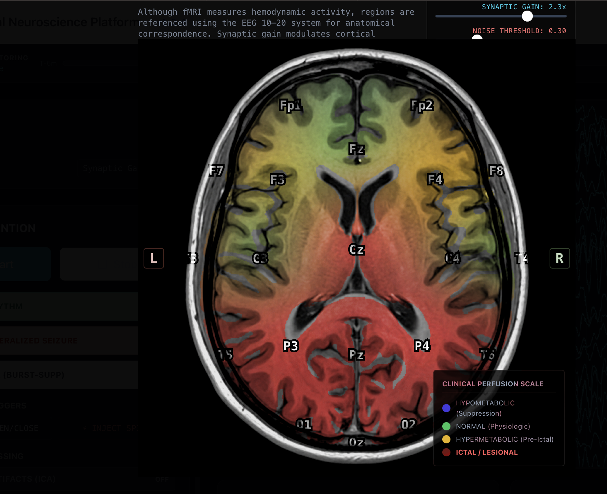

# NeuroSync Cortex Simulation System

NeuroSync is an advanced computational neuroscience platform designed to model, simulate, and visualize complex large-scale brain dynamics in real-time. By bridging mathematical biology with interactive visualization, NeuroSync allows clinical researchers and computational neuroscientists to explore emergent cortical behaviors ranging from healthy physiological background rhythms to pathological states such as seizures and burst suppression.

## The Scientific Problem & Theoretical Foundation

Understanding macroscopic brain activity requires traversing the gap between single-neuron spiking and large-scale, synchronized cortical oscillations. Our platform addresses the core problem of **Aşırı Nöronal Senkronizasyon (Excessive Neuronal Synchronization)** and the modeling of pathological network mechanisms, as well as distinguishing artifacts from true physiological signals during profound metabolic depletion.

We draw upon established theories in computational neurology to inform our model:
> 1. **Kandel, E. R., et al. (2021). *Principles of Neural Science*.**
>    *Problem Addressed:* The fundamental mechanisms of "aşırı nöronal senkronizasyon" (excessive neuronal synchronization) and the modeling of pathological network behaviors that lead to epileptogenesis.
> 2. **Ropper, A. H., et al. (2019). *Adams and Victor's Principles of Neurology*.**
>    *Problem Addressed:* The clinical morphology of seizures, the identification of "Burst-Suppression" patterns in the EEG, and the critical criteria for differentiating between true physiological signal suppression and network artifacts.
> 3. **Jirsa, V. K., et al. (2014). "On the nature of seizure dynamics." *Brain*, 137(8), 2210-2230.**
>    *Application:* Informs the phenomenological transitions between pre-ictal, ictal, and post-ictal states, specifically highlighting the role of slow-variable metabolic depletion.

To illustrate these theoretical models computationally, NeuroSync simulates populations of neural oscillators using **Kuramoto-style phase synchronization dynamics**.



_The plot above demonstrates our underlying computational model during a localized "Seizure Zone". As the coupling parameter ($K$) increases, the Order Parameter $R$ (blue line) surges, indicating hyper-synchronization. Consequently, the mathematical complexity of the signal—measured as Network Entropy (orange line)—momentarily drops, reflecting the rigid, locked states typical of pathological seizures._

---

## Clinical States & System Interface

The platform provides a highly detailed, real-time dashboard to monitor ongoing simulations. Below is a professional breakdown of the different operational modes and pathological states observable in the system.

### 1. Normal Physiological Rhythm

**State Analysis:** 
In a healthy resting state, the cortex exhibits standard background rhythms. Phase coherence ($R \approx 0.13$) is low, indicating asynchronous, independent processing across cortical columns. The Spectral Power Density shows a dominant **Alpha band (61.2%)**, typical of an awake, relaxed patient with closed eyes.

### 2. Generalized Seizure (Ictal State)

**State Analysis:** 
By increasing synaptic gain or regional coupling, the network is driven into a **Generalized Seizure**. Notice the abrupt shift in the EEG traces to high-amplitude, hyper-synchronous spike-and-wave discharges. The spectral density heavily shifts towards the **Delta band (92.3%)**, and Phase Coherence abruptly rises ($R \approx 0.29$). The Clinical Decision Support system flags a **CRITICAL: EXHAUSTION** warning as the hyper-metabolic state rapidly drains synaptic energy reserves.

### 3. Post-Ictal Exhaustion / Deep Suppression

**State Analysis:** 
Following prolonged seizure activity, or simulating the introduction of potent anesthetics (e.g., Propofol), the network enters a state of **Burst Suppression**. The EEG demonstrates long periods of isoelectric flatlining interspersed with brief bursts of activity (BSR: 7.8%). The Metabolic Reserve has plunged to **27.4%**, representing the profound refractory period cortical cells must undergo to restore ionic transmembrane gradients.

### 4. Direct Clinical Interventions

**State Analysis:** 
NeuroSync allows clinicians to actively shape the simulation. Using the **Intervention Panel**, researchers can inject pathological spikes, induce generalized seizures, or enforce anesthesia manually. Here, the system is responding to an injected stimulus, with the phase coherence ($R$) climbing as the network attempts to absorb the perturbation.

### 5. Spatial Perfusion Model (fMRI BOLD Simulation)

**State Analysis:** 
Beyond temporal EEG traces, NeuroSync maps electrical hyper-synchrony to a simulated spatial model representing hemodynamic response (approximating fMRI BOLD signals). As per the Clinical Perfusion Scale, the right hemisphere demonstrates intensely **Ictal / Lesional (red)** hypermetabolism due to high local firing rates, while contralateral regions remain relatively normal or hypometabolic (blue/green).

---

## Technical Architecture

- **Backend:** Python 3.9+, FastAPI, NumPy, SciPy. Models live mathematical differential equations and streams frame data via WebSockets.
- **Frontend:** React, Vite, TailwindCSS. Renders High-performance canvas-based EEG traces and SVG topology maps without dropping frames.

## Getting Started

1. Clone the repository to your local machine:
   ```bash
   git clone https://github.com/YOUR_USERNAME/YOUR_REPOSITORY.git
   cd YOUR_REPOSITORY
   ```

2. Load the dependencies and launch both servers simultaneously:
   ```bash
   chmod +x NeuroSync_Start.sh
   ./NeuroSync_Start.sh
   ```

3. Access the Clinical Dashboard at: **[http://localhost:5173](http://localhost:5173)**

*Note: For the images above to display correctly in your local repository, ensure you place the captured screenshots into the `screenshots` folder within the project root using the exact naming conventions (`1_normal_state.png`, etc.).*
